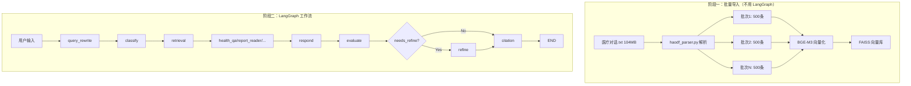

## 产品概述

将好大夫在线医疗对话数据（104MB，6万+条）导入本地 FAISS 向量库，并在 LangGraph 对话工作流中集成向量检索功能，实现 RAG（检索增强生成）能力。

## 核心功能

### 阶段一：批量导入（性能优先，不使用 LangGraph）

- 解析 `医疗对话.txt` 文件（按 `id=` 分割记录，流式读取避免内存溢出）
- 使用本地 BGE-M3 模型（`D:/models/emb models/bge-m3`）进行向量化
- 批量导入到 FAISS 向量库（使用 `add_texts` 批量接口，批次大小 500）
- 提供导入进度查询接口

### 阶段二：LangGraph 集成检索节点（质量优先）

- 创建 `retrieval` 节点：从 FAISS 向量库检索相关医疗对话
- 修改 LangGraph 工作流：在意图分类后、功能节点前插入检索节点
- 统一使用检索结果作为上下文，提高回答质量

## 技术栈

- **向量库**：FAISS（通过 LangChain 封装）
- **向量模型**：BGE-M3（本地模型，CUDA 加速）
- **后端框架**：FastAPI + LangChain + LangGraph
- **文件解析**：Python 生成器（流式读取）

## 实现方案

### 阶段一：批量导入（不用 LangGraph）

#### 1. 文件解析策略

- 创建 `server/utils/haodf_parser.py`
- 流式读取文件（逐行读取，不一次性加载到内存）
- 按 `id=` 模式分割记录
- 提取关键字段并合并为向量化文本：`"{疾病描述}\n{病情描述}\n{希望获得的帮助}"`
- 使用 Python 生成器 `yield` 逐条输出，避免内存占用

#### 2. 批量导入优化

- 在 `vector_store.py` 添加 `batch_import_haodf()` 方法
- 使用 LangChain FAISS 的 `add_texts()` 批量接口（而非逐条 `add_document()`）
- 批次大小：500 条/批（平衡内存和效率）
- 每批导入后保存索引（避免意外中断导致数据丢失）
- 预计导入时间：5-10 分钟（BGE-M3 + CUDA）

#### 3. 断点续传支持

- 导入前检查 FAISS 索引中已存在的记录 ID
- 跳过已导入的记录
- 支持增量导入新数据

#### 4. API 接口设计

在 `knowledge.py` 中添加：

- `POST /api/knowledge/import-haodf`：触发导入（后台任务）
- `GET /api/knowledge/import-progress`：查询导入进度
- `GET /api/knowledge/stats`：查询向量库统计信息

### 阶段二：LangGraph 集成（用于查询/对话）

#### 1. 创建检索节点

- 创建 `server/agent/nodes/retrieval.py`
- 从 `state["messages"]` 获取用户问题
- 调用 `vector_store_service.search()` 检索相关对话
- 将结果存入 `state["search_results"]` 和 `state["retrieved_docs"]`

#### 2. 修改 LangGraph 工作流

修改 `server/agent/graph.py`：

- 在 `classify` 节点之后、各功能节点之前插入 `retrieval` 节点
- 修改条件边：所有意图节点执行完后先到 `retrieval`，再到 `respond`

修改后的流程：

```
query_rewrite → classify → retrieval → [功能节点] → respond → evaluate → refine/citation
```

#### 3. 优化策略

- 并行检索：可同时查询多个知识库（当前只有一个）
- 条件检索：根据意图类型决定是否检索（例如 `unknown` 意图可能不需要检索）
- 检索结果去重和排序

## 架构设计



## 目录结构

```
server/
├── utils/
│   └── haodf_parser.py      [NEW] 好大夫数据解析工具
├── services/
│   └── vector_store.py       [MODIFY] 添加 batch_import_haodf 方法
├── api/
│   └── knowledge.py          [MODIFY] 添加导入接口和进度查询
└── agent/
    ├── nodes/
    │   ├── retrieval.py      [NEW] 检索节点
    │   └── __init__.py      [MODIFY] 导出 retrieval 节点
    ├── graph.py              [MODIFY] 在工作流中插入 retrieval 节点
    └── state.py              [NO CHANGE] 已有 search_results 字段
```

## 关键代码结构

**haodf_parser.py 核心接口：**

```python
def parse_haodf_file(file_path: str) -> Generator[dict[str, Any], None, None]:
    """
    流式解析好大夫数据文件
    
    Yields:
        每条记录：{
            "id": int,
            "url": str,
            "doctor": str,
            "content": str,  # 合并后的向量化文本
            "metadata": dict  # 原始字段
        }
    """
```

**vector_store.py 新增方法：**

```python
async def batch_import_haodf(
    self,
    file_path: str,
    batch_size: int = 500,
    progress_callback: Callable | None = None
) -> dict[str, int]:
    """
    批量导入好大夫医疗对话数据
    
    Args:
        file_path: 医疗对话.txt 路径
        batch_size: 每批导入数量
        progress_callback: 进度回调函数
        
    Returns:
        {"total": 总数, "imported": 导入数, "skipped": 跳过数}
    """
```

## Agent Extensions

### SubAgent

- **高级开发工程师**
- Purpose: 审查批量导入代码的性能和错误处理，确保 6 万条数据导入的稳定性和效率
- Expected outcome: 完成代码审查，提出性能优化建议，确保导入功能稳定可靠