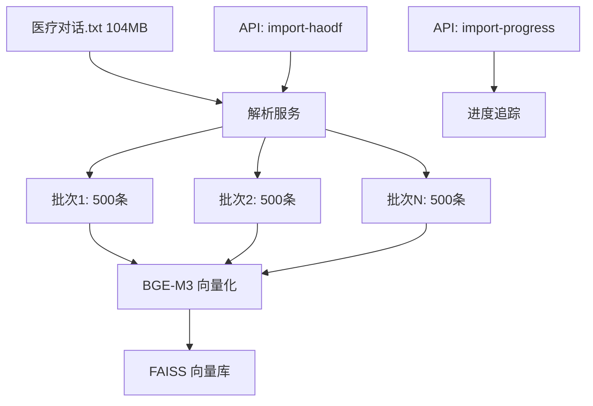

## 需求描述

将 `d:\个人医疗助手\医疗对话.txt`（104.86MB，6万+条医疗对话）批量导入到本地 FAISS 向量库。

### 功能内容

- 解析好大夫在线医疗对话文件（每条记录以 `id=X` 分隔）
- 使用本地 BGE-M3 向量模型（`D:/models/emb models/bge-m3`）进行向量化
- 批量导入到 FAISS 向量库（`./vector_store_faiss`）
- 提供导入进度反馈接口

### 数据格式

每条记录包含：

- `id=X`：记录编号
- URL：医生主页链接
- Doctor faculty：医生科室
- Description：疾病描述、病情描述、希望获得的帮助
- 其他字段：怀孕情况、患病多久、过敏史、既往病史等

## 技术方案

### Tech Stack

- **向量库**：FAISS（通过 LangChain 封装）
- **向量模型**：BGE-M3（本地模型，CUDA 加速）
- **后端框架**：FastAPI + LangChain
- **文件解析**：Python 流式读取（避免加载 104MB 文件到内存）

### Implementation Approach

#### 1. 文件解析策略

- 流式读取文件（逐行读取，不一次性加载到内存）
- 按 `id=` 模式分割记录
- 提取关键字段：病情描述、疾病描述、医生信息
- 将多条相关字段合并为一条向量化文本

#### 2. 批量导入优化

- 使用 LangChain FAISS 的 `add_texts()` 批量接口（而非逐条 `add_document()`）
- 批次大小：100-500 条/批（平衡内存和效率）
- 每批导入后保存索引（避免意外中断导致数据丢失）
- 预计导入时间：5-10 分钟（BGE-M3 + CUDA）

#### 3. 断点续传支持

- 导入前检查 FAISS 索引中已存在的记录 ID
- 跳过已导入的记录
- 支持增量导入新数据

#### 4. API 接口设计

- `POST /api/knowledge/import-haodf`：触发导入（后台任务）
- `GET /api/knowledge/import-progress`：查询导入进度
- `GET /api/knowledge/stats`：查询向量库统计信息

### Architecture Design



### Directory Structure

```
server/
├── services/
│   └── vector_store.py  [MODIFY] 添加批量导入方法
├── api/
│   └── knowledge.py     [MODIFY] 添加导入接口
└── utils/
    └── haodf_parser.py  [NEW] 好大夫数据解析工具
```

### Key Code Structures

**vector_store.py 新增方法：**

```python
async def batch_import_haodf(
    self,
    file_path: str,
    batch_size: int = 500,
    progress_callback: Callable | None = None
) -> dict[str, int]:
    """
    批量导入好大夫医疗对话数据
    
    Args:
        file_path: 医疗对话.txt 路径
        batch_size: 每批导入数量
        progress_callback: 进度回调函数
        
    Returns:
        {"total": 总数, "imported": 导入数, "skipped": 跳过数}
    """
```

**haodf_parser.py 核心接口：**

```python
def parse_haodf_file(file_path: str) -> Generator[dict[str, Any], None, None]:
    """
    流式解析好大夫数据文件
    
    Yields:
        每条记录：{"id": int, "url": str, "doctor": str, "content": str, "metadata": dict}
    """
```

## Agent Extensions

### SubAgent

- **高级开发工程师**
- Purpose: 审查批量导入代码的性能和错误处理
- Expected outcome: 确保 6 万条数据导入的稳定性和效率