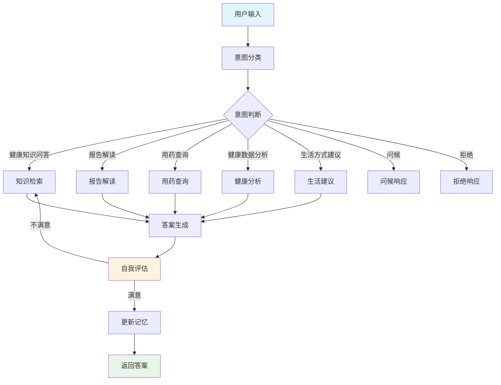

# 个人医疗助手 - Medical QA Agent

基于 LangGraph 构建的智能医疗问答系统，支持健康档案管理、报告解读、用药查询等功能。采用双层级记忆系统、混合检索策略和 self-correction 机制，提供专业、个性化的医疗健康服务。

## 项目结构

```
个人医疗助手/
├── server/                        # 服务端
│   ├── main.py                    # FastAPI 主入口
│   ├── config.py                 # 配置文件
│   ├── api/                      # API 路由
│   │   ├── chat.py               # 对话接口
│   │   ├── profile.py            # 健康档案
│   │   └── knowledge.py          # 知识库管理
│   ├── agent/                    # LangGraph Agent
│   │   ├── graph.py              # 图定义（14个节点）
│   │   ├── state.py              # 状态模型
│   │   ├── nodes/                # 节点实现
│   │   │   ├── classify.py       # 意图分类
│   │   │   ├── retrieve.py       # 知识检索
│   │   │   ├── generate.py      # 答案生成
│   │   │   ├── medical_analysis.py # 医疗分析
│   │   │   ├── report_reader.py # 报告解读
│   │   │   ├── drug_query.py    # 用药查询
│   │   │   ├── health_assessment.py # 健康评估
│   │   │   ├── lifestyle.py     # 生活方式建议
│   │   │   ├── update_memory.py # 记忆更新
│   │   │   ├── self_correction.py # 自我修正
│   │   │   ├── greeting.py      # 问候处理
│   │   │   └── reject.py        # 拒绝处理
│   │   ├── tools/                # 工具函数
│   │   │   ├── hybrid_retrieve.py # 混合检索（未接入）
│   │   │   ├── rerank.py        # 重排序（未接入）
│   │   │   └── web_search.py    # 联网搜索
│   │   └── prompts/              # 提示词模板
│   ├── services/                 # 业务服务
│   │   ├── vector_store.py       # FAISS向量库
│   │   ├── memory_service.py     # 双层级记忆服务
│   │   ├── ragflow_service.py    # RAGFlow集成（未接入）
│   │   └── langfuse_service.py   # LangFuse追踪
│   └── models/                   # 数据模型
├── data/                         # 数据目录
│   ├── knowledge_base.json       # 系统知识库
│   └── user_memory.json          # 用户记忆
├── vector_store_faiss/           # FAISS向量索引
│   ├── knowledge_base.faiss      # 知识库索引
│   ├── knowledge_base.pkl        # 知识库元数据
│   ├── user_memory.faiss        # 用户记忆索引
│   └── user_memory.pkl          # 用户记忆元数据
├── docker-compose.yml            # Docker编排
├── pyproject.toml               # 项目配置
├── requirements.txt              # 依赖列表
└── README.md
```

## 核心特性

### 1. 智能意图路由
自动识别用户意图，分为5类场景：
- **健康知识问答**：基于权威医学知识库回答
- **报告解读**：解读体检报告、化验单等
- **用药查询**：查询药品说明、相互作用
- **健康数据分析**：基于用户档案的个性化分析
- **生活方式建议**：饮食、运动、作息建议

### 2. 双层级记忆系统
- **短期记忆**：会话内上下文保持
- **长期记忆**：基于FAISS的持久化记忆索引，支持跨会话记忆

### 3. 混合检索策略
- **向量检索**：BGE中文嵌入模型 + FAISS
- **关键词检索**：BM25算法
- **融合排序**：RRF（Reciprocal Rank Fusion）
- **重排序**：CrossEncoder（待接入）

### 4. Self-Correction 机制
生成答案后自动评估质量，不满意则重新检索生成，最多迭代2次。

### 5. 多模型支持
- **小米大模型**：主力对话模型
- **可扩展**：支持切换其他LLM提供商

### 6. 可观测性
集成 LangFuse，完整追踪每次对话的执行过程。

## 快速开始

### 环境要求

- Python 3.11+
- Docker & Docker Compose（可选）
- 足够的内存用于加载嵌入模型

### 安装依赖

```bash
# 使用 Poetry
poetry install

# 或使用 pip
pip install -r requirements.txt
```

### 配置环境变量

创建 `.env` 文件：

```env
# LLM配置
LLM_PROVIDER=xiaomi
LLM_MODEL=mi-gpt-4
LLM_API_KEY=your_api_key
LLM_API_BASE=https://api.xiaomi.com

# 嵌入模型
EMBEDDING_MODEL=BAAI/bge-large-zh-v1.5

# 向量库
VECTOR_STORE_PATH=./vector_store_faiss
KNOWLEDGE_BASE_PATH=./data/knowledge_base.json

# LangFuse追踪
LANGFUSE_PUBLIC_KEY=your_public_key
LANGFUSE_SECRET_KEY=your_secret_key
LANGFUSE_HOST=https://cloud.langfuse.ai
```

### 启动服务

```bash
# 启动后端服务
poetry run uvicorn server.main:app --reload --host 0.0.0.0 --port 8000

# 或使用 Docker
docker-compose up -d
```

### 访问服务

- **API 服务**: http://localhost:8000
- **API 文档**: http://localhost:8000/docs
- **LangFuse 追踪**: 配置后可查看执行详情

## API 使用示例

### 1. 发起对话

```bash
curl -X POST "http://localhost:8000/api/chat" \
  -H "Content-Type: application/json" \
  -d '{
    "user_id": "user_001",
    "message": "我最近血糖有点高，需要注意什么？",
    "session_id": "session_001"
  }'
```

### 2. 查看健康档案

```bash
curl -X GET "http://localhost:8000/api/profile/user_001"
```

### 3. 更新健康档案

```bash
curl -X POST "http://localhost:8000/api/profile" \
  -H "Content-Type: application/json" \
  -d '{
    "user_id": "user_001",
    "data": {
      "blood_sugar": "偏高",
      "allergies": ["青霉素"]
    }
  }'
```

### 4. 知识库管理

```bash
# 上传文档到知识库
curl -X POST "http://localhost:8000/api/knowledge/upload" \
  -F "file=@medical_book.pdf"

# 搜索知识库
curl -X GET "http://localhost:8000/api/knowledge/search?q=糖尿病饮食"
```

## 工作流程



### 详细流程说明

1. **意图分类**：使用LLM分析用户输入，确定意图类型
2. **条件路由**：根据意图类型路由到对应处理节点
3. **知识检索**：并行检索系统知识库和用户长期记忆
4. **答案生成**：基于检索结果和用户上下文生成答案
5. **自我评估**：评估答案质量，不满意则重新检索（最多2次）
6. **记忆更新**：将重要信息保存到用户长期记忆
7. **返回结果**：返回最终答案和溯源信息

## 技术架构

### 核心技术栈

- **Web框架**: FastAPI
- **Agent框架**: LangGraph (StateGraph)
- **向量数据库**: FAISS
- **嵌入模型**: BGE-large-zh-v1.5
- **LLM**: 小米大模型（可切换）
- **追踪**: LangFuse
- **容器化**: Docker

### 检索策略详解

```
用户查询
    ↓
┌─────────────────────────────┐
│  并行检索                    │
│  ├─ 向量检索 (FAISS)        │
│  ├─ BM25 关键词检索         │
│  └─ 用户长期记忆检索        │
└─────────────────────────────┘
    ↓
RRF 融合排序
    ↓
Top-K 结果
    ↓
（可选）CrossEncoder 重排序
    ↓
生成答案
```

### 记忆系统设计

```
短期记忆（会话内）
├── 当前对话历史
└── 临时上下文
    ↓
长期记忆（跨会话）
├── FAISS 向量索引
├── 用户健康档案
└── 历史对话摘要
```

## 开发指南

### 代码规范

```bash
# 代码检查
poetry run ruff check .

# 代码格式化
poetry run ruff format .

# 类型检查
poetry run mypy server/
```

### 添加新功能

1. **添加新节点**：在 `server/agent/nodes/` 创建新节点文件
2. **注册到图谱**：在 `server/agent/graph.py` 添加节点和边
3. **添加工具**：在 `server/agent/tools/` 创建新工具
4. **更新提示词**：在 `server/agent/prompts/` 添加提示词模板

### 调试技巧

1. **查看 LangFuse**：追踪每次对话的完整执行过程
2. **查看向量库**：检查检索结果的相关性
3. **测试意图分类**：使用不同类型的用户输入测试分类准确性
4. **检查记忆更新**：验证重要信息是否被正确保存到长期记忆

### 性能优化建议

1. **嵌入模型**：使用更轻量的嵌入模型加速检索
2. **向量库**：定期清理过期的用户记忆
3. **缓存策略**：对常见问答对进行缓存
4. **异步处理**：充分利用 LangGraph 的异步执行能力

## 未来规划

- [ ] 接入 CrossEncoder 重排序
- [ ] 实现混合检索（hybrid_retrieve.py）
- [ ] 支持多模态输入（图片、PDF）
- [ ] 添加用药提醒功能
- [ ] 集成可穿戴设备数据
- [ ] 支持多用户并发对话
- [ ] 添加 A/B 测试框架

## 许可证

MIT License

## 贡献指南

欢迎提交 Issue 和 Pull Request！

1. Fork 本项目
2. 创建特性分支 (`git checkout -b feature/AmazingFeature`)
3. 提交更改 (`git commit -m 'Add some AmazingFeature'`)
4. 推送到分支 (`git push origin feature/AmazingFeature`)
5. 打开 Pull Request

## 联系方式

如有问题，请提交 Issue 或联系维护团队。
